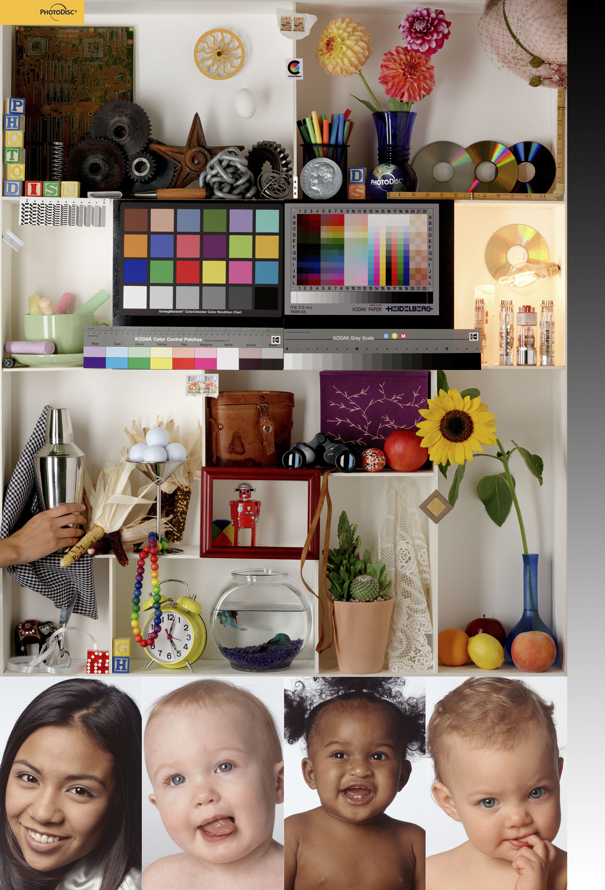

# Printing

> Directory initially created to host resources for an automated printing routine with the goal of preventing ink cartridges from drying out from infrequent use.

## To Determine Destination Printer Name

> lpstat -p | awk '{print $2}'

command will show the name of the first available printer

### Defaults

`lpstat` may or may not have a default printer assigned, which can be determined by executing

> lpstat -d

## Setting up Cronjob

Installed the following cronjob with `crontab -e`

```
0 10 * * 4#1 /home/miller/git/config/printing/print.sh
```

which varies slightly from the more common examples in that

- seconds arent specified
- `?` (and probly other special characters) arent supported

---

## Test Images

> From https://www.northlight-images.co.uk/printer-test-images/

### PDI 



### Fuji sRGB Test Image at 300ppi


